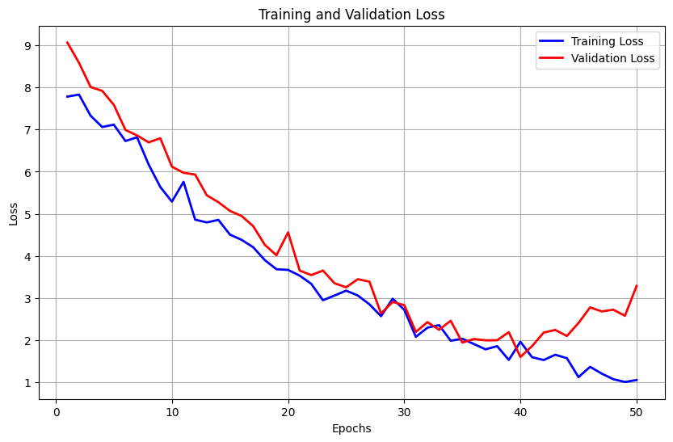
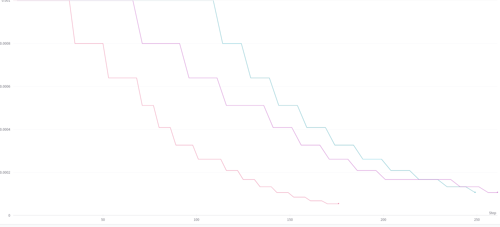
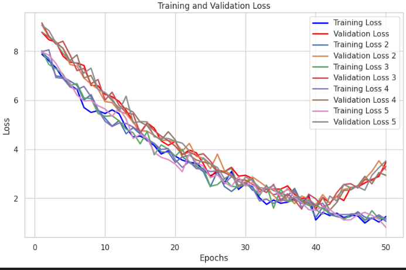

# Transformer

# Jainit Bafna 
## 2021114003

[Link to the trained model and output ](https://iiitaphyd-my.sharepoint.com/:u:/g/personal/jainit_bafna_research_iiit_ac_in/Eb_nbfWh8jxPryc0Tp0eBVkBerXSasNx2g08wkXk910Hag?e=ihymw0)

### Results Obtained for different Hyperparameters: 

| Model | Learning Rate | Batch Size | Dropout | Layers | Best Loss | Bleu Score (Train) | Bleu Score (Test) |
|-------|---------------|-----------|---------|--------|-----------|--------------------|-----------------|
| 1     | 1e-3           | 8         | 0.10    | 2     | 0.9528    | 0.0763             | 0.05335         |
| 2     | Sched           | 16         | 0.30    | 2     | 0.7350    | 0.0797             | 0.0678          |
| 3     | 1e-4           | 16         | 0.15    | 2     | 0.8927    | 0.0583             | 0.0725          |
| 4     | Sched         | 8         | 0.20    | 2     | 1.0505    | 0.0592             | 0.0672          |

Best model was obtained for Model 2 with a learning rate scheduler, batch size of 16, dropout of 0.3 and 2 layers.

